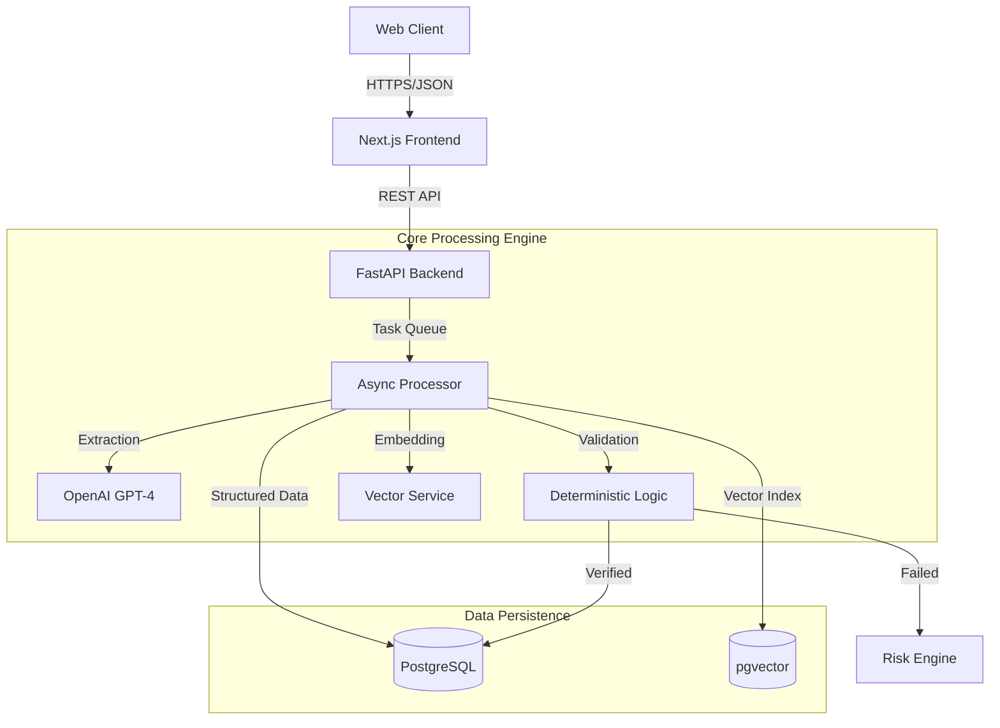

# 🏦 FinSight AI: Enterprise Financial Document Intelligence


[](https://www.typescriptlang.org/)
[](https://nextjs.org/)
[](https://fastapi.tiangolo.com/)
[](https://www.postgresql.org/)
[](https://www.docker.com/)

---

## 📋 Executive Summary

**FinSight AI** is a specialized financial intelligence platform designed to automate the ingestion, extraction, validation, and analysis of complex financial documents. Unlike generic OCR tools, FinSight employs a **Hybrid Intelligence Architecture**—combining the flexibility of Large Language Models (LLMs) for unstructured text extraction with the precision of deterministic code for mathematical validation.

This project was engineered to solve the "Hallucination Problem" in financial AI, ensuring that all processed data supports **audit-ready** standards through strict rule-based verification layers.

---

## 🏗️ System Architecture

 The system is designed as a distributed microservices architecture, containerized via Docker for consistent deployment environments.



### Key Components
1.  **Frontend**: Built with **Next.js 14** (App Router), leveraging Server Components for optimized rendering and **Tailwind CSS** for a responsive, accessible design system.
2.  **Backend API**: High-concurrency **FastAPI** service handling request validation, auth (planned), and orchestration.
3.  **Persistence Layer**: **PostgreSQL 15** serving as both the relational store (Users, Documents, Logs) and the vector store (via `pgvector` extension) for semantic search.

---

## 🧠 Core Intelligence Engine

### 1. Hybrid Extraction Pipeline
The platform processes documents (PDF, DOCX, Images) through a multi-stage pipeline:
*   **OCR/Text Extraction**: High-fidelity text recovery.
*   **Semantic Classification**: Identifies document type (e.g., *Invoice, P&L, Bank Statement*) to select the correct extraction schema.
*   **LLM Extraction**: Uses temperature-controlled LLM calls to map unstructured text to strict Pydantic models.

### 2. Deterministic Validation Protocol (The "FinSight Standard")
To ensure financial integrity, data extracted by AI must pass a rigid validation gate. Pure code verifies:
*   **Arithmetic Consistency**: `Subtotal + Tax == Total` (Tolerance: ±0.01).
*   **Balance Continuity**: `Opening Balance + Credits - Debits == Closing Balance`.
*   **Cross-Reference Checks**: Ensuring line item summation matches declared totals.

*Any discrepancy here triggers a "Math Anomaly" flag, independent of AI confidence scores.*

### 3. Risk & Anomaly Detection
Rule-based logic scans validated data for compliance risks:
*   **Round Number Anomalies**: Often a signal of fraud.
*   **High Velocity/Value**: Flags transactions exceeding historical norms.
*   **Keyword Risk**: Scans for "Restricted," "Sanction," or "Cash" keywords in descriptions.

---

## 🛠️ Technology Stack Breakdown

| Layer | Technology | Reason for Choice |
| :--- | :--- | :--- |
| **Frontend** | Next.js 14 + TypeScript | Strict type safety, server-side rendering for performance. |
| **Styling** | Tailwind + Shadcn UI | Commercial-grade aesthetics, accessibility-first components. |
| **Backend** | Python 3.11 + FastAPI | Async I/O support for handling heavy ML workloads non-blockingly. |
| **Database** | PostgreSQL + pgvector | Unified database for relational data and vector embeddings (simpler stack). |
| **ORM** | SQLAlchemy 2.0 | Modern async ORM pattern for database interactions. |
| **AI Orchestration** | LangChain | Structured output parsing and chain management. |
| **Containerization** | Docker Compose | Reproducible development and production environments. |

---

## ⚙️ Environment Configuration

The application requires the following environment variables to be set in a `.env` file at the project root.

| Variable | Description | Required? |
| :--- | :--- | :--- |
| `OPENAI_API_KEY` | Your OpenAI API Key for GPT-4 and Embeddings. | **Yes** |
| `DATABASE_URL` | Connection string `postgresql://user:pass@db:5432/finsight` | **Yes** |
| `SECRET_KEY` | Cryptographic key for session/token signing. | **Yes** |
| `MAX_UPLOAD_SIZE` | Limit in MB for file uploads (Default: 10MB). | No |
| `LOG_LEVEL` | Logging verbosity (DEBUG, INFO, WARNING). | No |

---

## 🚀 Getting Started

### Prerequisites
*   Docker Desktop (v4.20+)
*   Git

### Installation

1.  **Clone the Repository**
    ```bash
    git clone https://github.com/your-username/FinSight-AI.git
    cd FinSight-AI
    ```

2.  **Configure Environment**
    ```bash
    # Windows
    copy .env.example .env
    # Linux/Mac
    cp .env.example .env
    ```
    *Open `.env` and add your `OPENAI_API_KEY`.*

3.  **Ignition**
    ```bash
    docker-compose up --build -d
    ```

    *   Frontend: [http://localhost:3000](http://localhost:3000)
    *   Backend Docs: [http://localhost:8000/docs](http://localhost:8000/docs)

---

## 📡 API Reference Coverage

The backend exposes a fully documented OpenAPI (Swagger) interface. Key endpoints include:

*   **`POST /api/v1/documents/upload`**: Multipart form upload for PDF/Images.
*   **`GET /api/v1/documents/{id}/analysis`**: Retrieve extraction results and validation report.
*   **`POST /api/v1/search/query`**: Vector-based semantic search across the document knowledge base.
*   **`GET /api/v1/audit/logs`**: Fetch immutable audit trails for compliance review.

---

## 🛡️ Security Measures

*   **Input Sanitization**: All file uploads are scanned for mime-type and magic-byte consistency.
*   **Data Isolation**: processing occurs in isolated temporal directories.
*   **Audit Logging**: Every create, read, update, or delete action is logged to the `audit_logs` table.

---

Built with ☕ and 🧪 by **Smitesh Pednekar**
[LinkedIn](https://www.linkedin.com/in/smiteshpednekar/) | [GitHub](https://github.com/smitesh-pednekar)
